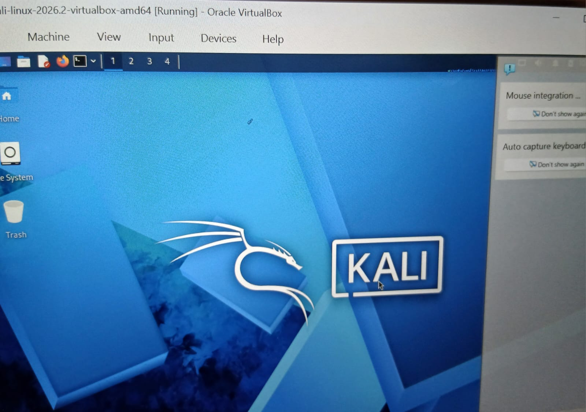

<div align="center">

# 🔐 Cybersecurity Lab Environment Setup

**Building an isolated virtual lab for penetration testing and ethical hacking practice**
</div>

<p align="center">
  
  
  
  
  
  
  
  
  
  
  
  
</p>

---

I managed to set up my first Cybersecurity lab setup and it was successful.

# 🛡️ Virtual Cybersecurity Lab Environment

## 📌 Project Overview

This project documents the creation of a virtual cybersecurity laboratory using
VirtualBox and Kali Linux.

The laboratory provides a controlled environment for learning and practicing
cybersecurity concepts, network administration, reconnaissance, security
assessment, and other authorized security-testing techniques.

The virtual environment uses an isolated NAT Network, allowing virtual machines
to communicate within a controlled network while maintaining connectivity
through the configured virtual network.

---

## 🎯 Project Objectives

The main goals of this laboratory setup are to:

- Install and configure Oracle VirtualBox.
- Set up Kali Linux as a virtual machine.
- Create a dedicated NAT Network for the laboratory.
- Configure Kali Linux network connectivity.
- Assign and verify the required IP configuration.
- Test communication between the virtual machine and the network gateway.
- Verify external connectivity and DNS resolution.
- Create a VM snapshot for easy recovery.
- Document the configuration and troubleshooting process.
- Establish a foundation for future cybersecurity laboratory exercises.

---

## 🔐 Laboratory Environment

The laboratory consists of a virtualized network designed specifically for
cybersecurity learning and authorized testing.

### Main Components

| Component | Configuration |
|-----------|---------------|
| Hypervisor | Oracle VirtualBox |
| Operating System | Kali Linux |
| Network Type | NAT Network |
| Network Address | `10.0.0.0/24` |
| Gateway | `10.0.0.1` |
| DNS Server | `8.8.8.8` |
| Network Interface | `eth0` |

> **Note:** Network addresses and interface names may differ depending on the
> VirtualBox and Kali Linux configuration.

---

## 🌐 Network Configuration

The Kali Linux virtual machine is connected to a dedicated NAT Network.

The network uses the following addressing scheme:

```text
Network:       10.0.0.0/24
Gateway:       10.0.0.1
DNS:           8.8.8.8
Kali Linux:    10.0.0.x

## 🏗️ Kali Linux Successful launch
# SCREENSHOTS
.
